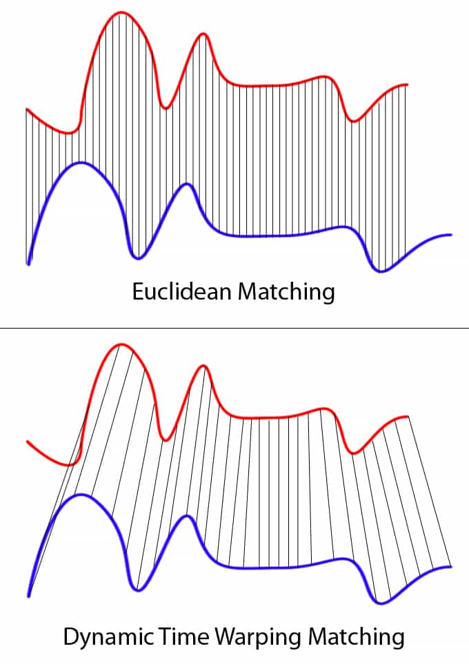
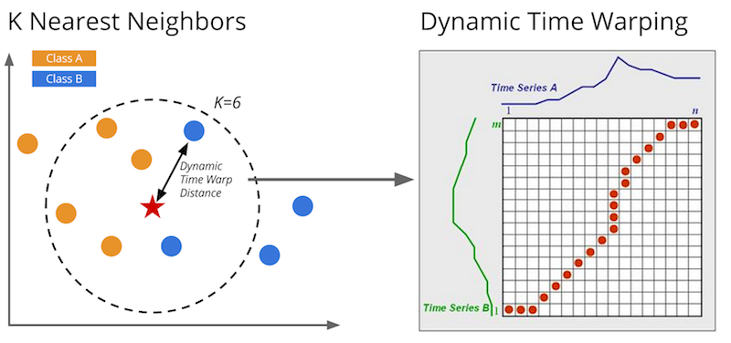

[English Version](Enunciado.EN.md)

# Trabalho de Implementação - Projeto e Análise de Algoritmos - 2026-1 - Mestrado em Informática

Trabalho de implementação da matéria Projeto e Análise de Algoritmos do Mestrado em Informática da PUC Minas.

## Enunciado

Pontifícia Universidade Católica de Minas Gerais

Programa de Pós-graduação em Informática

Disciplina: Projeto e Análise de Algoritmos

Prof. Alexei Machado

### Trabalho de Implementação

Valor: 40 pontos

Data: 23/06/2026 19:00 pelo Canvas.

Trabalho individual

#### Descrição

O problema da correspondência (alinhamento, casamento, deformação) entre duas séries temporais consiste em estabelecer uma medida de similaridade (ou distância) entre sequências ordenadas no tempo, possivelmente de comprimentos diferentes, sujeitas a ruído, variações de escala, deslocamentos temporais e distorções não lineares. Esse problema é central em diversas aplicações, como análise de sinais biomédicos, reconhecimento de fala, áudio, monitoramento industrial e finanças.

Formalmente, dadas duas séries temporais  X = (x1, x2, ... , xn)  e  Y = (y1, y2, ... , ym) , o objetivo é encontrar um alinhamento ou uma função de correspondência u(xi)=yj que associe cada elemento de X a um elemento de Y minimizando uma medida de custo entre os elementos das duas séries e respeitando certas restrições temporais, como monotonicidade e continuidade. Assim, se um elemento xi for associado a um elemento yj, todo xk , k>i, deverá ser associado a algum yl , l>=j. A Fig. 1 mostra o exemplo de mapeamento de X para Y e a Fig. 2 o esquemático do resultado do alinhamento na forma de matriz.

Figura 1. Exemplo de mapeamento da série X (azul) para a série Y (vermelha).

Figura 2. Exemplo de mapeamento da série A (azul) para a série B (verde).

Uma dificuldade importante é que eventos semelhantes podem ocorrer em ritmos diferentes nas duas séries. Por exemplo, dois sinais de Eletrocardiograma podem representar o mesmo fenômeno fisiológico, mas com frequências cardíacas distintas, o que inviabiliza comparações ponto a ponto simples. Portanto, durante o alinhamento, um intervalo de X pode sofrer uma compressão ou dilatação, caso seja mapeado a um intervalo de menor ou maior comprimento, respectivamente.

É fácil concluir que uma solução por força bruta para o problema da correspondência de séries temporais terá complexidade exponencial, pois cada um dos n elementos de X poderá ser mapeado para ordem de m elementos de Y, sendo então O(nm). A técnica de projeto por programação dinâmica, no entanto, é capaz de reduz a complexidade a uma função polinomial com o gasto de pouca memória auxiliar.

Neste trabalho, você deverá implementar soluções eficientes baseadas em programação dinâmica para o problema de alinhamento séries temporais e analisar o comportamento de diversos datasets frente a essas soluções. O algoritmo usado como baseline de comparação experimental será o Dynamic Time Warping (DTW) (Sakoe & Chiba, 1978; Berndt & Clifford, 1994), a partir do qual foram propostas variações como:

1.  Continuous Dynamic Time Warping (Munich & Perona,1999;  Buchin et al. 2022).

2.  Derivative Dynamic Time Warping (Keogh & Pazzani, 2001).

3.  Longest Common Subsequence (Vlachos et al. 2002).

4.  Edit Distance on Real Sequence (Chen et al. 2005).

5.  Time Warp Edit Distance (Marteau, 2009).

6.  Soft-DTW (Cuturi & Blondel, 2017).

7.  ShapeDTW (Zhao & Itti, 2018).

8.  Amerced Dynamic Time Warping (Herrmann & Webb, 2023).

#### Implementação

1.  Programe uma interface gráfica para o projeto para exibir 2 séries lado a lado e o mapeamento entre elas, semelhante ao exemplificado na Fig. 1. Isso servirá para avaliar se os algoritmos estão realizando o mapeamento de forma correta. Forneça também a matriz de alinhamento semelhante à Fig. 2.

2.  Implemente o algoritmo de DTW básico, com opção de janela de busca (Constrained DTW) (Sakoe & Chiba, 1978; Berndt & Clifford, 1994).

3.  Implemente os algoritmos competidores sorteados para você.
4.  Realize os experimentos usando os datasets atribuídos para você, dentro do repositório da base de dados UCR Time Series (Dau et al. 2019) (https://www.cs.ucr.edu/%7Eeamonn/time_series_data_2018/). Cada dataset é composto de um arquivo de descrição (readme), de um arquivo de treino e um de teste no formato tsv. Cada linha do arquivo é uma série, sendo a primeira posição o número da classe e as demais contendo os valores da série. Leia a documentação apresentada no site para maiores detalhes e exemplos de plots.

5.  Os resultados obtidos com os algoritmos implementados devem ser a base para algum classificador a sua escolha, O vizinho mais próximo (1-NN) costuma dar resultados muito bons, mas outros classificadores podem ser experimentados. Use o conjunto de treino dos datasets para ajustar o classificador, se necessário, mas a taxa de erro deve ser obtida do conjunto de teste. Por exemplo, você pode alinhar cada série X do conjunto de teste às séries Y do conjunto de treino e escolher a que produziu menor custo de alinhamento. Depois basta verificar se a classe de X é a mesma da série Y. Reporte a taxa de acertos para cada dataset e verifique qual algoritmo obteve maior acurácia.

6.  Analise o comportamento das bases de dados frente aos algoritmos, de forma a buscar agrupamentos de datasets que apresentem alta correlação dos resultados. Calcule a matriz de correlação de Spearman entre os datasets, baseado nos valores de acurácia obtidos pelos 5 algoritmos (DTW mais os sorteados). Plote a matriz na forma de um mapa de calor. Essa matriz representará os pesos das arestas de um grafo completo, onde os vértices são os datasets.

7.  Baseado no grafo obtido, implemente uma solução eficiente para o problema do clique máximo, que indicará o maior grupo de datasets com alta correlação entre seus elementos. O valor de limiar de correlação deve ser um parâmetro do método. Após encontrado o clique máximo, os vértices correspondente devem ser removidos e o método aplicado aos restantes para achar o próximo clique máximo e assim por diante, até todos os vértices serem agrupados.

8.  Apresente a análise de complexidade de tempo dos algoritmos e o meça o tempo médio necessário para executar os experimentos (calcule a média/desvio padrão). Compare e discuta os valores. Não se esqueça de indicar a configuração de hardware e o software usado.

9.  Apresente a análise de complexidade para o gasto de memória dos algoritmos.

| Aluno | Algoritmos | Datasets |
| ------| -----------|----------|
| Henrique Mendonça Castelar Campos | DTW+1+2+3+6 | 97 a 128 |

#### Documentação

Documente as soluções e os testes, na forma de um relatório técnico em formato Latex e PDF com no máximo 15 páginas, segundo o padrão da SBC de uma coluna, contendo as seguintes seções:

a.  Introdução: Descrever o problema e o objetivo do trabalho.

b.  Solução proposta: Descrever os algoritmos usados para a solução do problema através de pseudocódigo.

c.  Implementação: Descrever os datasets e os detalhes dos programas implementados, principalmente aqueles utilizados para melhorar a eficiência da solução.

d.  Relatório de testes: Descrever os testes realizados e seus resultados, mostrando como ficou o alinhamento em alguns exemplos.

e.  Conclusão: Discutir os resultados obtidos, comparando as soluções quanto à sua ordem de complexidade de tempo e memória, e quanto ao tempo de execução medido.

f.  Bibliografia segundo o padrão ABNT.

Considerações gerais e critérios de avaliação

1.  O trabalho deverá ser feito de forma individual sendo vedado o uso de geradores de código ou documentação por IA, mas exemplos de implementação podem ser consultados em repositórios e devidamente referenciados na documentação.

2.  A codificação do trabalho deve ser feita em linguagem Python, Java ou C++ em um arquivo único.

3.  Os trabalhos (código-fonte e relatório com fontes Latex e PDF final) devem ser postados na forma de um arquivo compactado no padrão ZIP, com tamanho máximo de 10 MB. Não insira os datasets no arquivo. Os fontes devem estar no diretório raiz  do arquivo compactado e devem conter o nome de todos os componentes do grupo no início do código. A apresentação será feita a partir do código postado no Canvas.

4.  A avaliação será baseada nos seguintes critérios:

•  Correção, robustez e eficiência dos programas quanto ao tempo de processamento e uso de memória

•  Conformidade às especificações

•  Clareza e estilo de codificação (comentários, endentação, escolha de nomes para identificadores, parametrização)

•  Relatório

#### Referências

Sakoe, H., & Chiba, S. (1978). Dynamic programming algorithm optimization for spoken word recognition. IEEE Transactions on Acoustics, Speech, and Signal Processing, 26(1), 43–49.

Berndt, D. J., & Clifford, J. (1994). Using dynamic time warping to find patterns in time series. AAAI Workshop on Knowledge Discovery in Databases.

Munich, M. E., & Perona, P. (1999, September). Continuous dynamic time warping for translation-invariant curve alignment with applications to signature verification. In Proceedings of the Seventh IEEE International Conference on Computer Vision (Vol. 1, pp. 108-115). IEEE.

Keogh, E., & Pazzani, M. (2001). Derivative Dynamic Time Warping. In Proceedings of the 1st SIAM International Conference on Data Mining (SDM).

Vlachos, M., Kollios, G., & Gunopulos, D. (2002). Discovering similar multidimensional trajectories. Proceedings of the 18th International Conference on Data Engineering (ICDE).

Chen, L., Özsu, M. T., & Oria, V. (2005). Robust and fast similarity search for moving object trajectories. Proceedings of the ACM SIGMOD International Conference on Management of Data.

Keogh, E., & Ratanamahatana, C. A. (2005). Exact indexing of dynamic time warping. Knowledge and information systems, 7(3), 358-386.

Marteau, P.-F. (2009). Time Warp Edit Distance with stiffness adjustment for time series matching. IEEE Transactions on Pattern Analysis and Machine Intelligence, 31(2), 306–318.

Zhao, J., & Itti, L. (2018). shapedtw: Shape dynamic time warping. Pattern Recognition, 74, 171-184.

Dau, H. A., Bagnall, A., Kamgar, K., Yeh, C. C. M., Zhu, Y., Gharghabi, S., ... & Keogh, E. (2019). The UCR time series archive. IEEE/CAA Journal of Automatica Sinica, 6(6), 1293-1305.

Cuturi, M., & Blondel, M. (2017). Soft-DTW: a differentiable loss function for time-series. Proceedings of the 34th International Conference on Machine Learning (ICML).

Buchin, K., Nusser, A., & Wong, S. (2022). Computing continuous dynamic time warping of time series in polynomial time. arXiv preprint arXiv:2203.04531.

Herrmann, Matthieu; Webb, Geoffrey I. (2023). "Amercing: An intuitive and effective constraint for dynamic time warping". Pattern Recognition. 137 109333.